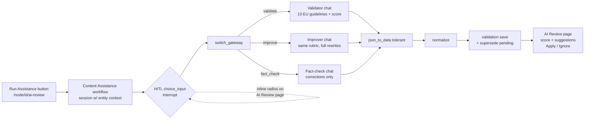
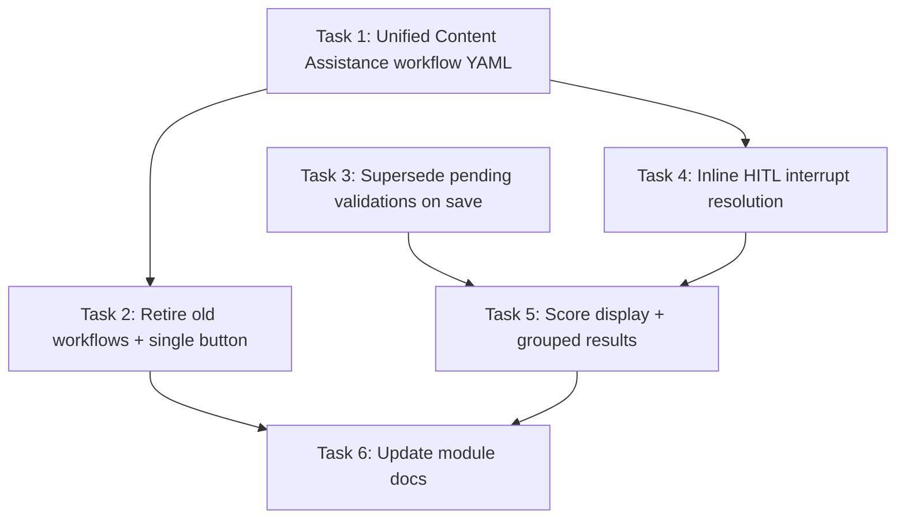

# Plan: Unify AI Review Assistance Workflow & UX

## Original Work Order

> we have created a logic to do content validation with AI using FlowDrop workflows, we created the next workflows:
> 1. Content Validation (flowdrop_workflow.flowdrop_workflow.content_validation.yml), this workflow will validate the content (article) based on EU guidelines, returning the average of quality and suggesting changes if need it.
> 2. Content Validation Fixer (flowdrop_workflow.flowdrop_workflow.content_validation_fixer.yml), this workflow will fix the content based on demand validation, but I am not sure which guidelines it is following, because the prompt it is not mentioning nothing
>
> Then we have two more workflows Fact Check and Fact Check Fixer, but seems like they need improvement, they are not working as expected and they are creating a lot of noise.
>
> **How the workflows are trigger:** We are using a module called FlowDrop Node session which is providing a flowdrop node processor to trigger the workflow and passing node data, in this case we are adding a new operation to the content called "AI Review", when you click there, it will send you to /node/node_id/ai-review […] we have two orange buttons: 1. Run Assistance 2. Run Fact Check, the first one is running the Content validation fixer workflow and suggesting some changes, seems like one of the parts is not working well because we are getting a NOTICE "Automatic Tagging assistance has been disabled temporarily because of adverse performance. > This is just an example message." and the second one is running the Fact Check workflow, which is also providing suggestion but not working well.
>
> **Approach:** I would like you to help me to find a better approach, for instances, just Run assistance, it will trigger the Content Validation workflow, where we could decide if check the content (Fact Check) or improve it (Content validation fixer), in these case we would need to fix the workflows. Right now, when you click on Run Assistance, it is showing a status message saying that it needs your inputs and sending the user to the Content page /admin/content, on my eyes, this is not the best approach, when user click on Run assistance, it should keep there in the AI Review page, and maybe opening a modal to see the suggestions or average and of course this should be listed on /node/node_id/ai-review, but in a way that the user can easily understand, right now it is just a mess.

## Plan Clarifications

| Question | Answer |
|---|---|
| How should the workflows be consolidated behind the single "Run Assistance" button? | **One unified workflow**: one "Content Assistance" workflow with an HITL choice (Validate / Improve / Fact Check) and three branches in the same canvas; standalone `fact_check` and `content_validation` are retired. |
| How should the HITL choice be answered on the AI Review page? | **Inline on the page**: render the pending interrupt's options as radios + Continue directly on `/node/{id}/ai-review`, resolving via `InterruptManager`. No redirect, no JS dependency. |
| How should repeated runs be handled to kill duplicate-validation noise? | **Supersede pending items**: on save, prior `pending` items for the same node + workflow are marked superseded; applied/ignored history kept. Implemented in the validation-save node processor. |
| Backwards compatibility for old workflows and the two-button setup? | **Retire them**: no BC. Disable/delete superseded workflow configs, remove the second button from `flowdrop_node_session.settings`. `scheduled_validator` is handled explicitly (see Notes) because it launches the retired workflows headlessly. |

## Executive Summary

Editors currently face two orange buttons on the AI Review page that trigger four half-finished FlowDrop workflows, produce a placeholder "NOTICE" message wired into the improve branch by mistake, dump users onto `/admin/content` mid-flow, and accumulate duplicate validation items on every run. This plan consolidates everything into **one "Content Assistance" workflow** entered from a single **Run Assistance** button: the workflow asks the editor once — Validate, Improve, or Fact Check — and every branch emits the same structured JSON contract (summary, quality score where applicable, and field-level suggestions) that the existing `AiReviewForm` can render as an actionable apply/ignore table.

The approach reuses what already works: `content_validation_fixer` already contains the HITL `choice_input` + `switch_gateway` skeleton and the normalize→save pipeline; the fact-check chat prompt from `fact_check` becomes a third branch; the 10 EU Commission guidelines and 1–100 quality score from `content_validation` become the shared rubric across all branch prompts. The broken pieces are deleted rather than patched: the placeholder NOTICE detour, the `fact_check_fixer` stub, and the redirect-based interrupt resolution.

The outcome is a demo-ready loop that never leaves `/node/{id}/ai-review`: click Run Assistance → answer one inline question → see the score and suggestions grouped by status → apply selected changes as a new revision. Old pending items are superseded automatically, so the page stays readable no matter how many times the workflows run.

## Context

### Current State vs Target State

| Current State | Target State | Why? |
|---|---|---|
| Two buttons (Run Assistance, Run Fact Check) triggering different workflows | One "Run Assistance" button triggering the unified Content Assistance workflow | One entry point; the choice of action belongs inside the workflow (HITL), not in the button row |
| Improve branch routes through `prompt_template.7` → `chat_output.4` showing a hardcoded "NOTICE: Automatic Tagging assistance has been disabled…" placeholder | Placeholder nodes deleted; the improve branch triggers the improver chat directly | The NOTICE is demo cruft confusing users into thinking a feature is broken |
| Improver prompt vaguely lists standards inline; `content_validation` defines the canonical 10 EU guidelines + 1–100 score separately | All branch prompts share the same explicit 10 EU Commission guidelines rubric; validate branch returns a 1–100 quality score in structured JSON | User couldn't tell which guidelines the fixer followed; rubric must be consistent and visible |
| `content_validation` saves status `done` with unstructured free-text result — nothing actionable in the UI | Validate branch saves status `pending` with structured `{score, summary, suggestions[]}` the form renders | Results must be reviewable/appliable, not a wall of text |
| `fact_check` creates a new validation item on every run (noise, acknowledged in its own canvas note); `fact_check_fixer` is a "Work in progress" stub | Fact Check is a branch reusing the structured contract; save processor supersedes prior pending items; `fact_check_fixer` removed | Kill duplicate noise; remove dead config |
| HITL interrupt redirects to `flowdrop_interrupt.detail`, user ends up on `/admin/content` | Interrupt options rendered inline on the AI Review page as radios + Continue, resolved via `InterruptManager`; user never leaves the page | Core UX complaint of the work order |
| Validation history is a flat list of collapsed details, "just a mess" | Grouped Pending / Done / Ignored / Superseded, newest pending open, quality score displayed prominently | Legibility for editors and for the DrupalCon demo |
| `scheduled_validator` headlessly launches `fact_check` + `content_validation` via `workflow_executor` | `scheduled_validator` disabled (`status: false`) with its executor nodes noted for later repointing | Its targets are retired; a headless launch of an HITL workflow would hang awaiting input |

### Background

- Hackathon repo (Drupal CMS 2.0.0-beta2 / Drupal 11.3), branch `feature/drupal-con-rotterdam-2026`; this feeds a DrupalCon Rotterdam 2026 demo ("AI Assists, Humans Decide").
- Hard constraints: amazee.io is the only permitted AI provider; at least one Mistral model must be used (current workflows use `mistral-medium-latest` / `mistral-large-latest`); config lives in `config/sync` and must be exported with `drush cex` after changes.
- FlowDrop 2.x stored workflow format; workflow YAML edited by hand must be verified with `drush flowdrop:workflow:diagnose` (config sync bypasses save-time validation).
- Key existing assets: `AiReviewForm` (`web/modules/custom/ai_content_validation/src/Form/AiReviewForm.php`) already implements synchronous turn execution, suggestion tableselect, fragment-merge apply logic, and revision creation. `ai_content_validation_normalize` node processor and `flowdrop_node_processor_validation_save` already exist. `flowdrop_node_session.settings.entity_operations` drives the button list.
- Structured AI output in FlowDrop is prompt-engineered (temperature 0, "output only JSON") through `json_to_data` with `parse_mode: tolerant` — the fixer's validate path already does this correctly and is the pattern to standardize on.
- Ponytail/minimal-change mode: modify the existing `content_validation_fixer` canvas in place (renamed/relabelled "Content Assistance") rather than authoring a new workflow from scratch.

## Architectural Approach

### Workflow consolidation (config/sync)

**Objective**: One `content_validation_fixer` (relabelled "Content Assistance") canvas containing all three actions; retired workflows removed.

Edit `flowdrop_workflow.flowdrop_workflow.content_validation_fixer.yml` in place:
- Extend `choice_input.1` options with a third choice `fact_check` ("Fact Check") and add a matching `fact_check` branch to `switch_gateway.1`.
- Delete `prompt_template.7` and `chat_output.4`; rewire `switch_gateway.1-output-improve` to trigger the improver pipeline (`prompt_template.3` → `flowdrop_ai_provider_chat.2`) directly.
- Add a fact-check branch: the `mistral-large-latest` chat node with the fact-check system prompt lifted from `fact_check`, fed by the existing `data_to_json.1` article payload, triggered from `switch_gateway.1-output-fact_check`, feeding the shared `json_to_data.5` → `ai_content_validation_normalize.1` → `flowdrop_node_processor_validation_save.1` tail (the fixer already demonstrates two chats feeding one `json_to_data` node).
- Relabel the workflow "Content Assistance"; keep the machine id `content_validation_fixer` to avoid breaking `field_flowdrop_workflow` references on existing validation items and the entity_operations config (renaming the id is explicitly out of scope).
- Retire `content_validation`, `fact_check`, `fact_check_fixer` (delete YAML from `config/sync`) and set `scheduled_validator` to `status: false` (see Notes).
- Update `dependencies.config` lists accordingly and verify with `drush flowdrop:workflow:diagnose content_validation_fixer` after `drush cim`/`cex` round-trip.

### Shared prompt & result contract

**Objective**: Every branch follows the same rubric and emits JSON the UI can act on.

- Canonical rubric: the 10 EU-inspired guidelines already enumerated in `content_validation`'s system prompt (Accuracy & Evidence … Practical Value), stated identically in all three branch prompts.
- Canonical output: the entity-save payload already used by the fixer, with `field_validation_result` as an object `{"score": 1-100 (validate branch; omitted or null for improve/fact-check), "summary": string, "suggestions": [{field, label, current, suggested, reason}]}` and `field_validation_status: "pending"`.
- Validate branch = analysis + score + suggestions only for failed guidelines; Improve branch = full rewritten values; Fact-check branch = corrections for factual errors only, empty suggestions when accurate. Temperature 0 on validate/fact-check; keep the existing anti-markdown/no-links guardrails.
- `ai_content_validation_normalize` is extended only if needed to pass `score` through and stringify `field_validation_result` consistently.

### Supersede-on-save (ai_content_validation module)

**Objective**: Repeat runs replace stale pending results instead of stacking duplicates.

In the `flowdrop_node_processor_validation_save` processor (custom module): after saving the new item, query prior `ai_content_validation_item` entities with the same `field_content_revision.target_id` + `field_flowdrop_workflow` still in status `pending` and set them to `superseded` (new allowed value alongside pending/done/ignored). Applied (`done`) and `ignored` items are never touched. `accessCheck(FALSE)` with justification (system-level state transition, not user-facing read).

### AI Review page UX (AiReviewForm)

**Objective**: The whole loop happens on `/node/{id}/ai-review`.

- Single button: `entity_operations` in `flowdrop_node_session.settings` reduced to one entry ("Assistance" → `content_validation_fixer`).
- Inline interrupt resolution: replace `buildPendingInterrupts()`'s link to `flowdrop_interrupt.detail` (and `runWorkflow()`'s redirect there) with a rendered form section — the interrupt's message plus its choice options as radios and a Continue submit that resolves the interrupt through the interrupt manager and re-runs the turn/refreshes the page. Non-choice interrupt types fall back to a text field. No redirect anywhere; the form always returns to itself.
- Result presentation: parse `field_validation_result`; when a `score` is present render it prominently (large number/label at the top of the item); group items under Pending / Done / Ignored headings (superseded collapsed at the bottom or omitted); newest pending item open by default. Keep the existing tableselect + Apply/Ignore machinery unchanged.
- Drop `buildRecentResponses()`'s reliance on stray chat output for the improve path once results always land as validation items; keep it only as a fallback for error visibility.

## Risk Considerations and Mitigation Strategies

Technical Risks

- **Hand-edited workflow YAML breaks silently on config import** (sync bypasses R-rule validation): dangling edges after deleting the placeholder nodes, or a `switch_gateway` branch handle not matching the branch name.
    - **Mitigation**: run `drush flowdrop:workflow:diagnose content_validation_fixer` and the Workflow Doctor after import; verify branch handles are exactly `-output-improve` / `-output-validate` / `-output-fact_check` matching the configured branch `name` values.
- **LLM does not honor the JSON contract** (score missing, `field_validation_result` returned as string vs object inconsistently across branches).
    - **Mitigation**: `json_to_data` in `parse_mode: tolerant`; normalization node coerces both string-encoded and object forms; temperature 0 on validate/fact-check branches; explicit example output in every system prompt.
- **HITL resolution semantics**: resolutions are job-bound in FlowDrop 2.x; inline resolution must target the exact pending interrupt for the session created by this page.
    - **Mitigation**: reuse the existing session-context filtering already implemented in `buildPendingInterrupts()`; resolve by interrupt UUID, then re-poll turn status.

Implementation Risks

- **Retiring workflows breaks references**: existing `ai_content_validation_item` entities reference workflows via `field_flowdrop_workflow`; `scheduled_validator` launches retired ids by string.
    - **Mitigation**: keep the `content_validation_fixer` machine id; historical items referencing deleted `fact_check`/`content_validation` render as "Unknown workflow" (already handled with `$workflow?->label() ?? 'Unknown workflow'`); disable `scheduled_validator` instead of leaving it pointing at ghosts.
- **Hackathon time pressure**: modal/AJAX polish could eat the remaining time.
    - **Mitigation**: decision already made — plain inline form elements, no JS dialog; full-page rebuilds are acceptable.

Demo Risks

- **Synchronous turn execution latency** (`TurnOptions(wait: TRUE)`) with `maxTokens: 4000` rewrites can feel slow on stage.
    - **Mitigation**: acceptable for demo; keep max tokens as-is; the inline pending-interrupt section already shows state if the user reloads mid-run.

## Success Criteria

### Primary Success Criteria

1. `/node/{id}/ai-review` shows exactly one run button; clicking it and choosing each of Validate, Improve, and Fact Check inline produces a saved validation item with structured summary/suggestions (and a 1–100 score for Validate) — with the user never leaving the AI Review page.
2. The placeholder "NOTICE: Automatic Tagging assistance has been disabled…" message can no longer be produced by any branch, and the improve branch returns real improvement suggestions referencing the 10 EU guidelines.
3. Running the same action twice for a node yields exactly one `pending` item for that node+workflow (the older one becomes `superseded`); applied and ignored items keep their status and remain listed under their groups.
4. `config/sync` contains no `content_validation`, `fact_check`, or `fact_check_fixer` workflow YAML; `scheduled_validator` is disabled; `drush cim && drush flowdrop:workflow:diagnose content_validation_fixer` reports no findings.

## Self Validation

1. `ddev drush cim -y && ddev drush flowdrop:workflow:diagnose content_validation_fixer` — expect zero findings; `ddev drush cex -y && git status --porcelain config/sync` — expect no drift.
2. Playwright: log in via `ddev drush uli`, navigate to `/node/{nid}/ai-review` for the "Understanding the European Commission" article; screenshot: assert exactly one primary run button and no "Run Fact Check" button.
3. Playwright: click Run Assistance; assert the page URL is still `/node/{nid}/ai-review` and the choice options (Validate / Improve / Fact Check) render inline as radios; select "Run Validation", submit, wait for completion; screenshot: assert a quality score element and a suggestions table (or empty-suggestions summary) are visible.
4. Repeat the run; then `ddev drush sqlq` (or entity query via `drush php:eval`) on `ai_content_validation_item` for that nid: assert exactly one row with status `pending` for `content_validation_fixer` and at least one row with status `superseded`.
5. Playwright: select a suggestion, click Apply; assert a status message reporting a new revision, and via `/node/{nid}/revisions` screenshot confirm the new revision with the AI revision log message exists.
6. Playwright: exercise the Fact Check choice end-to-end on the "Debunking Common Health Myths" article; assert a validation item appears in the Pending group with fact-check suggestions and no raw JSON is rendered anywhere on the page.
7. Grep check: `grep -r "Automatic Tagging" config/sync web/modules/custom` returns nothing.

## Documentation

- Update `web/modules/custom/ai_content_validation/AI_CONTEXT.md`: unified workflow story, supersede semantics, new `superseded` status value, inline interrupt handling.
- Update the "Custom Modules" / workflow references in root `CLAUDE.md` only if workflow names it cites change (it cites none of the retired ids explicitly — verify).
- Note the retirement of `fact_check`/`fact_check_fixer`/`content_validation` and the `scheduled_validator` disable in the plan's execution notes for the DrupalCon presentation material (`dcon26_plan`).

## Resource Requirements

### Development Skills

- FlowDrop 2.x stored-format workflow authoring (nodes/edges/handles, gateway branches, HITL interrupts, config dependencies).
- Drupal 11 custom module development: FormAPI, entity queries, node processors, config management.
- Prompt engineering for structured JSON output with Mistral models.

### Technical Infrastructure

- DDEV environment with the site installed (`ddev install`), amazee.io provider credentials configured, Mistral models available.
- Drush (`cex/cim`, `flowdrop:workflow:diagnose`), Playwright MCP for validation, existing `ai_content_validation` and `flowdrop_node_session` modules.

## Notes

- **Machine id stays `content_validation_fixer`.** Only the label changes to "Content Assistance". Renaming the config entity id would cascade through `field_flowdrop_workflow` values on existing items, `entity_operations` settings, and prompt-embedded ids for zero demo value.
- **`scheduled_validator`** headlessly launches `fact_check` and `content_validation` via `workflow_executor` inside a foreach. Since both targets are retired and the unified workflow requires an HITL answer, it is set `status: false` rather than repointed. Making the unified workflow headless-capable (exposed `choice` input with a default that bypasses the interrupt) is explicitly deferred — a possible follow-up plan for the "scheduled mode" demo chapter.
- **Superseded vs delete**: superseded items are kept for audit/demo storytelling; if the list still feels noisy the UI simply hides the Superseded group — no schema change needed.
- The `note` canvas annotations in the retired `fact_check` workflow (duplicate-noise warning) are resolved by this plan and disappear with the file.

## Execution Blueprint

**Validation Gates:**
- Reference: `/config/hooks/POST_PHASE.md`

### Dependency Diagram

### ✅ Phase 1: Foundations (workflow + data model)
**Parallel Tasks:**
- ✔️ Task 1: Rework content_validation_fixer into the unified Content Assistance workflow — `completed`
- ✔️ Task 3: Supersede prior pending validation items on save — `completed`

### ✅ Phase 2: Config cleanup and inline HITL
**Parallel Tasks:**
- ✔️ Task 2: Retire superseded workflows and reduce AI Review to a single button (depends on: 1) — `completed`
- ✔️ Task 4: Resolve HITL interrupts inline on the AI Review page (depends on: 1) — `completed`

### ✅ Phase 3: Result presentation
**Parallel Tasks:**
- ✔️ Task 5: Prominent quality score and grouped validation results (depends on: 3, 4) — `completed`

### ✅ Phase 4: Documentation
**Parallel Tasks:**
- ✔️ Task 6: Update ai_content_validation documentation (depends on: 2, 5) — `completed`

### Post-phase Actions
- After each phase: run `POST_PHASE.md` gate; config-touching phases must survive `ddev drush cim -y` + `drush flowdrop:workflow:diagnose content_validation_fixer` and a clean `drush cex` round-trip.

### Execution Summary
- Total Phases: 4
- Total Tasks: 6

## Execution Summary

**Status**: ✅ Completed Successfully
**Completed Date**: 2026-08-27

### Results
- `content_validation_fixer` reworked in place into the unified **Content Assistance** workflow: HITL choice Validate / Improve / Fact Check, placeholder "Automatic Tagging" NOTICE detour deleted, fact-check chat added as a third branch into the shared normalize → save tail, all three prompts share the 10 EU guidelines rubric and the `{score, summary, suggestions[]}` result contract. `drush flowdrop:workflow:diagnose`: no findings.
- Retired `content_validation`, `fact_check`, `fact_check_fixer` (deleted); `scheduled_validator` disabled; `flowdrop_node_session.settings` reduced to the single "✨ Assistance" operation.
- New `ValidationSave` processor (`ai_content_validation:validation_save`, subclass of contrib `EntitySave`) supersedes prior pending items per node+workflow; `superseded` added to `field_validation_status` allowed values. Verified via drush integration script (ALL ASSERTIONS PASSED).
- `AiReviewForm`: HITL interrupts resolved inline (radios + Continue via `InterruptManagerInterface::resolveInterrupt()`, which auto-resumes the pipeline); no redirects off the page; results grouped Pending/Done/Ignored with prominent quality score, superseded collapsed, raw JSON never rendered. E2e-verified with Playwright including a real Mistral run (score 85/100, Apply → node revision 14).
- `AI_CONTEXT.md` updated; root CLAUDE.md/AGENTS.md needed no changes. phpcs (Drupal + DrupalPractice) clean on all touched PHP.

### Noteworthy Events
- Review gate outcome: `skipped` — reason `no-reviewer-candidate`, detail: "No harness other than `claude` is installed and responsive, so the review gate was skipped." No review rounds ran.
- Per the user's global git policy, the per-phase conventional commits required by POST_PHASE were **not** created; all changes are left uncommitted for the user to review and commit explicitly.
- Task 3 discovered `flowdrop_node_processor_validation_save` had no custom processor (it pointed at contrib `flowdrop_node_processor:entity_save`); a thin module subclass was added and the node type repointed — workflow YAML unchanged. Note: contrib `EntitySave` is `@internal`.
- `field_content_revision` is entity_reference_revisions: writes need both `target_id` and `target_revision_id`, or the field silently stores empty.
- Contrib insight: `InterruptManager::resolveInterrupt()` synchronously resumes the pipeline via `SessionInterruptResolvedSubscriber` — callers must not re-invoke `executeTurn()`.
- Pre-existing dblog noise: cron-queued runs of the deleted workflows failing with `Unknown input "id"`; disabling `scheduled_validator` stops new ones.

### Necessary follow-ups
- Commit the changes (config/sync + module + docs) once reviewed — nothing is committed yet.
- Headless/scheduled mode: expose a `choice` input with a default on the unified workflow (or a dedicated headless variant) before re-enabling `scheduled_validator`.
- Legacy pending items referencing retired workflows (e.g. `fact_check_fixer` items 19/24 on node 2) stay pending forever — optionally bulk-ignore them for a clean demo database.
- Contrib `EntitySave` is `@internal`; a contrib refactor could require adjusting `ValidationSave`.
